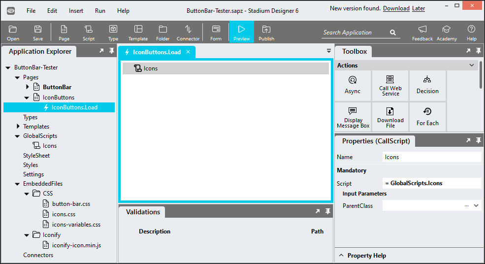

# Button Bars

Use a Button Bar to combine the triggers for a number of related features into one interface element. 

https://github.com/stadium-software/button-bar/assets/2085324/07ca94ed-7f60-433f-9f56-7b785c62c5b6

## Best Practices
- Use button groups to organize similar functionality. Don't group buttons just because they're close together.
- For most use-cases, only default button types should be used in button groups. In rare cases, primary buttons can be included in button groups but there should only ever be one primary button (if any) in a button group.
- Avoid grouping too many buttons together. It could be overwhelming to the user.
- Do not use a button group to indicate a selection. Use a Toggle Button instead (https://github.com/stadium-software/toggle-buttons).
- Do not use a button group as a replacement for tab navigation (https://github.com/stadium-software/tabs).
- Avoid mixing buttons with text labels with icon-only buttons.

## Version 
1.0 - initial

# Setup

## Application Setup
1. Check the *Enable Style Sheet* checkbox in the application properties

## Page Setup
1. Drag a *Flexbox* control into the page 
2. Add a class called "stadium-button-bar" into the *Flexbox* classes property
3. Drag some *Button* controls into the *Flexbox* control
4. Add the text you wish to show on the buttons into the text property

## Button Icons
To display icons in buttons, the [Icons Module](https://github.com/stadium-software/icons) must be implemented in the application and the Icons script needs to be called in the Page.Load event handler. You can then apply classes to the button controls as described in the [Icons Module](https://github.com/stadium-software/icons) to display icons in buttons. 



# Styling
Various elements in this module can be styled using the two CSS files in this repo

## Applying the CSS

**Stadium 6.6 or higher**
1. Create a folder called "CSS" inside of your Embedded Files in your application
2. Drag the two CSS files from this repo [*button-bar-variables.css*](button-bar-variables.css) and [*button-bar.css*](button-bar.css) into that folder
3. Paste the link tags below into the *head* property of your application
```html
<link rel="stylesheet" href="{EmbeddedFiles}/CSS/button-bar.css">
<link rel="stylesheet" href="{EmbeddedFiles}/CSS/button-bar-variables.css">
``` 


**Versions lower than 6.6**
1. Copy the CSS from the two css files into the Stylesheet in your application

## Customising CSS
1. Open the CSS file called [*button-bar-variables.css*](button-bar-variables.css) from this repo
2. Adjust the variables in the *:root* element as you see fit
3. Overwrite the file in the CSS folder of your application with the customised file

## CSS Upgrading
To upgrade the CSS in this module, follow the [steps outlined in this repo](https://github.com/stadium-software/samples-upgrading)
